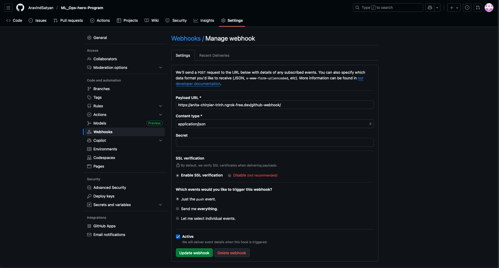
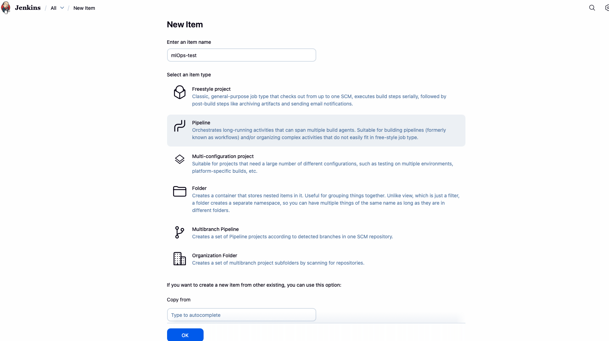
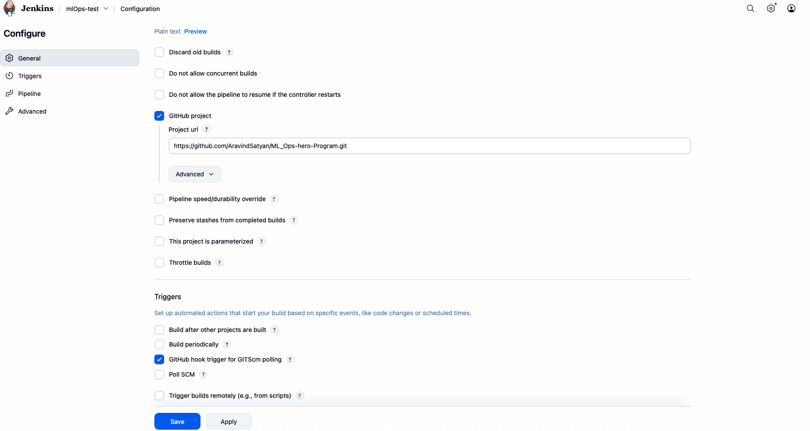
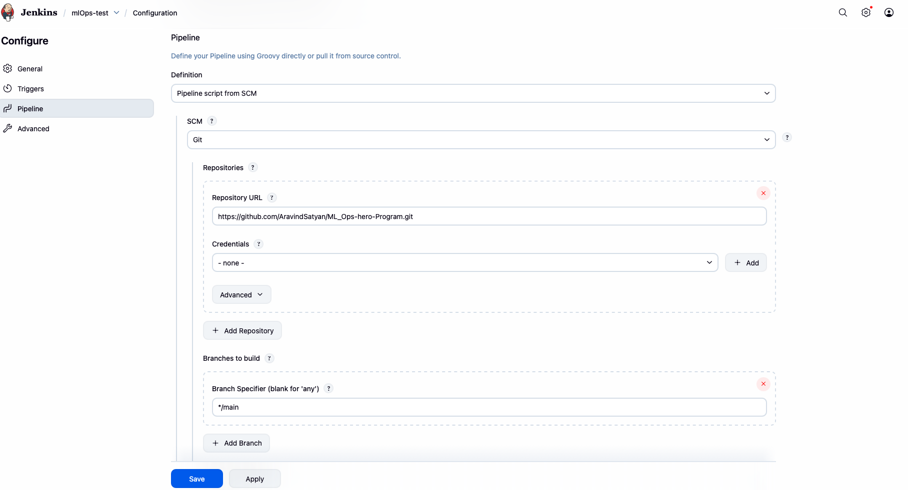

<!-- instructions to run it in Mac -->
<!-- visit this link and debug your jenkins setting for reference
https://anita-chirpier-trinh.ngrok-free.dev/job/mlOps-test/ -->

# start Docker Desktop (graphical app)
open -a Docker

# wait for Docker to initialize, then verify Docker daemon is reachable
# this may take a few seconds; run repeatedly until 'docker info' succeeds
docker info
# or quick check
docker version

docker network create mlops-net

# tag is local; pipeline builds tags differently when Jenkins runs
docker build -t data-cleaner:local .

docker run -d --name data-cleaner \
  --network mlops-net \
  -p 8000:8000 \
  data-cleaner:local

docker ps --filter name=data-cleaner
curl -sS http://localhost:8000/  # or the app's health endpoint if present

# create jenkins data volume
docker volume create jenkins_home

# run Jenkins (detached) on the mlops-net
docker run -d --name jenkins \
  --network mlops-net \
  -p 8080:8080 -p 50000:50000 \
  -v jenkins_home:/var/jenkins_home \
  -v /var/run/docker.sock:/var/run/docker.sock \
  jenkins/jenkins:lts

  # install docker CLI inside the container (run as root)
docker exec -u root jenkins bash -lc "apt-get update && apt-get install -y docker.io"

# add the jenkins user to docker group (allow running docker without root)
docker exec -u root jenkins bash -lc "usermod -aG docker jenkins || true"

# install common Jenkins plugins needed for pipeline + multibranch + GitHub
docker exec -u root jenkins bash -lc "/usr/local/bin/install-plugins.sh workflow-aggregator docker-workflow git github-branch-source credentials-binding"
# restart Jenkins so plugins and docker-group change apply
docker restart jenkins

## after running the command below, copy the key given in the output
docker exec jenkins cat /var/jenkins_home/secrets/initialAdminPassword

# install ngrok (if needed)
brew install --cask ngrok

# Authenticate (replace with your ngrok authtoken)
# replace <NGROK_AUTH_TOKEN> with your token from ngrok.com

ngrok config add-authtoken <NGROK_AUTH_TOKEN> 

# open HTTP tunnel to Jenkins (8080)
ngrok http 8080
# ngrok will print a forwarding URL like https://abcd-1234.ngrok.io

# setting in github, remember to add "github-webhook/" after you input your ngrok link

# setting in Jenkins UI

# uncheck the lightweight checkout

# instructions to run it in Windows

# start Docker Desktop
- Launch "Docker Desktop" from Start menu or system tray.
- Ensure WSL 2 backend is enabled (Docker Desktop > Settings).
- Enable "Expose daemon on tcp://localhost:2375 without TLS" (Settings > General or Settings > Docker Engine) so containers can control the host Docker daemon. Restart Docker Desktop if prompted.

# open an elevated PowerShell (run as Administrator) and verify Docker
docker version
docker info

# create network
docker network create mlops-net

# build the data-cleaner image (tag is local)
docker build -t data-cleaner:local .

# run the app container
docker run -d --name data-cleaner `
    --network mlops-net `
    -p 8000:8000 `
    data-cleaner:local

# verify and health-check (PowerShell)
docker ps --filter name=data-cleaner
# using PowerShell's Invoke-WebRequest
Invoke-WebRequest http://localhost:8000 -UseBasicParsing
# or curl if available
curl http://localhost:8000

# create a named volume for Jenkins data
docker volume create jenkins_home

# run Jenkins and allow it to reach the Docker daemon via the exposed TCP socket
docker run -d --name jenkins `
    --network mlops-net `
    -p 8080:8080 -p 50000:50000 `
    -v jenkins_home:/var/jenkins_home `
    -e DOCKER_HOST=tcp://host.docker.internal:2375 `
    jenkins/jenkins:lts

# (Alternative advanced option)
# If you prefer not to expose the Docker daemon over TCP, research mounting the Docker named pipe into the container or use a Docker-in-Docker image. The TCP method above is the simplest on Windows.

# install docker CLI inside the Jenkins container (run as root)
docker exec -u root jenkins bash -lc "apt-get update && apt-get install -y docker.io"

# allow the jenkins user to use docker without root (may be optional with TCP method)
docker exec -u root jenkins bash -lc "usermod -aG docker jenkins || true"

# install common Jenkins plugins needed for pipelines + multibranch + GitHub
docker exec -u root jenkins bash -lc "/usr/local/bin/install-plugins.sh workflow-aggregator docker-workflow git github-branch-source credentials-binding"

# restart Jenkins so plugin and group changes apply
docker restart jenkins

# get the initial admin password (copy the output to finish setup in the web UI)
docker exec jenkins cat /var/jenkins_home/secrets/initialAdminPassword

# install ngrok on Windows
# Option A: download from https://ngrok.com and run the installer
# Option B (if you have Chocolatey): choco install ngrok -y
# Once ngrok is available, add your authtoken and open a tunnel:
ngrok config add-authtoken <NGROK_AUTH_TOKEN>
ngrok http 8080
# ngrok will print a forwarding URL like https://abcd-1234.ngrok.io

# GitHub webhook notes
- In GitHub webhook settings use the forwarded ngrok URL and append "github-webhook/" (e.g. https://abcd-1234.ngrok.io/github-webhook/).
- Configure the Jenkins GitHub Branch Source with that webhook and appropriate credentials.

# Jenkins UI
- Open Jenkins at http://localhost:8080 (or the ngrok public URL).
- During job/multibranch config, you may want to disable "Lightweight checkout" for pipeline steps that need full workspace/credentials.

# troubleshooting tips
- If containers can't reach the host Docker, confirm "Expose daemon on tcp://localhost:2375 without TLS" is enabled and that host.docker.internal resolves inside containers.
- If ports are in use, change the -p host:container mappings.
- Use docker logs <container> to inspect container output.
